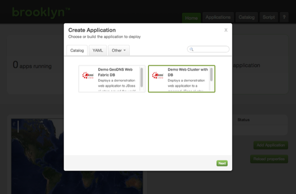
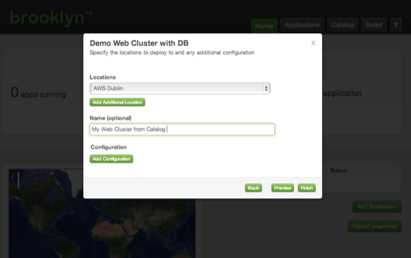
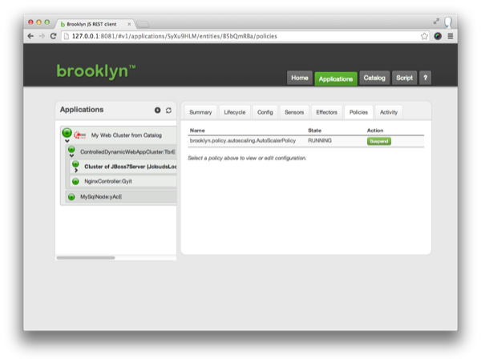



Brooklyn at its heart is a policy driven management plane, which can implement both business and technical policies.

We'll use Brooklyn's Service Catalog functionality to quickly load a demo app which shows two Policies in action.

## Service Catalogs

Brooklyn allows application blueprints to be stored in a Service Catalog.

Download the template [catalog.xml](catalog.xml) to your `~/.brooklyn/` folder, and relaunch Brooklyn.


$ cd ~/.brooklyn
$ wget {{site.url}}/use/guide/quickstart/catalog.xml

$ brooklyn launch


Now when we open the web console, two applications are displayed from the catalog. Select the 'Web Cluster with DB' and click 'Next'.

Select the Location that Brooklyn should deploy to, and name your application:

Clicking 'Finish' will launch the application as before.

### Exploring and Testing Policies

This application is pre-configured with two polices.

The app server cluster has an `AutoScalerPolicy`, and the loadbalancer has a `targets` policy.

Drill down into the 'ControlledDynamicWebAppCluster' to the 'Cluster of JBoss7Server' and select the 'Policies' tab.

You will see that the autoscaling policy is running.

This policy will automatically scale the cluster up or down to be the
right size for the current load experienced by the cluster. ('One server' is the minimum size allowed by the policy.)
The loadbalancer's `targets` policy ensures that the loadbalancer is updated as the cluster size changes.

Sitting idle, this cluster will only contain one server, but you can use a tool like [jmeter](http://jmeter.apache.org/) pointed at the nginx endpoint
to create load on the cluster. As load is added, Brooklyn requests a new cloud machine, creates a new app server, and adds it to the cluster.
As load is removed, servers are removed from the cluster, and the infrastructure is handed back to the cloud.

### Next

The [Elastic Web Cluster Example]({{site.url}}/use/examples/webcluster/index.html) page
details how to build the demo application from scratch. It shows how Brooklyn can
complement your application with policy driven management, and how an application can be
run without using the service catalog.