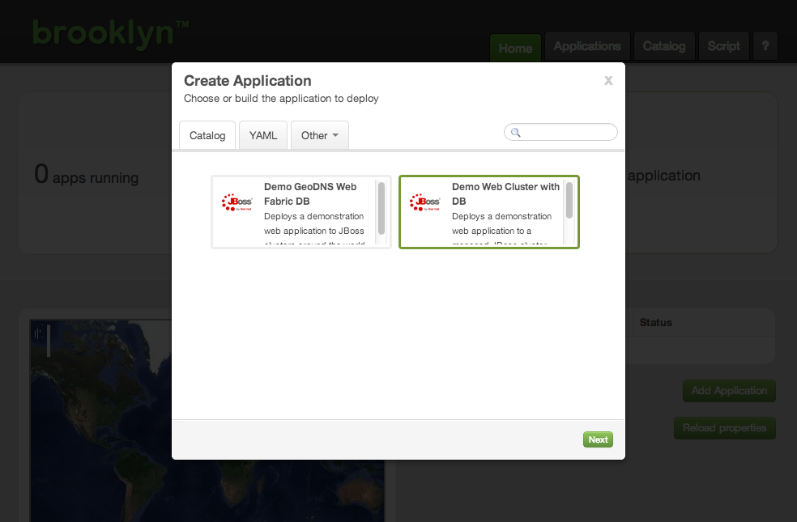
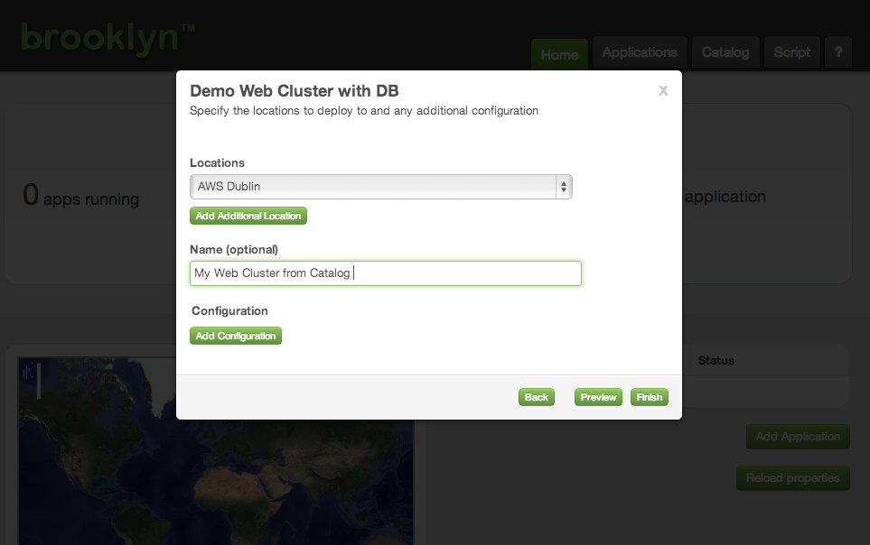
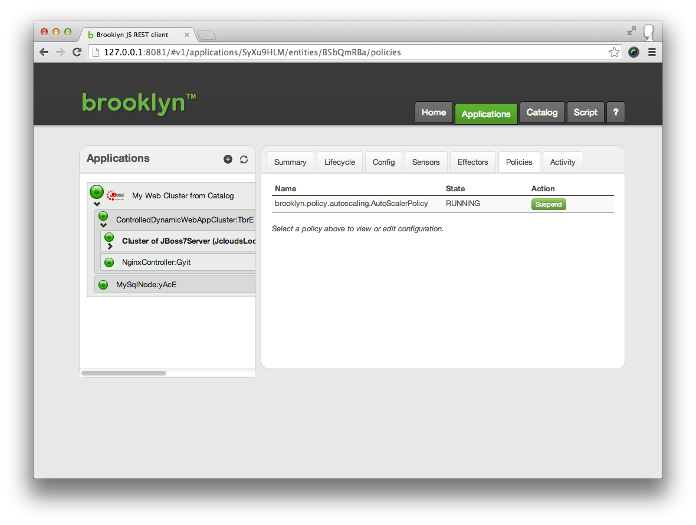



Brooklyn at its heart is a policy driven management plane, which can implement both business and technical policies.

We'll use Brooklyn's Service Catalog functionality to quickly load a demo app which shows Policies in action.

## Service Catalogs

Brooklyn allows application blueprints to be stored in a Service Catalog.

Download the template [catalog.xml](catalog.xml) to your `~/.brooklyn/` folder, and relaunch Brooklyn.


$ cd ~/.brooklyn
$ wget {{site.url}}/use/guide/quickstart/catalog.xml

$ brooklyn launch


This time on opening the web console there are two applications in the catalog. Select the 'Web Cluster with DB' and click 'Next'.

Select the location that Brooklyn should deploy to, and name your application:

Brooklyn will launch the application as before.

### Exploring and Testing Policies

This application has one key difference from the previous one we deployed - it's pre-configured with two polices.

The cluster of app servers has an `AutoScalerPolicy` attached and the loadbalancer has a `targets` policy.

Drill down into the ControlledDynamicWebAppCluster to the 'Cluster of JBoss7Server' and select the Policies tab.

Brooklyn at its heart is a policy driven management plane which can implement business and technical policies.

The Web Cluster with DB demo comes pre-configured with an `AutoScalerPolicy`, attached to
the cluster of JBoss7 servers and a `targets` policy attached to the loadbalancer. You can
 observe policies this in the management console using the Policy tab of the relevant
 entity (e.g. `DynamicWebAppCluster` shows the `AutoScalerPolicy`.

The cluster autoscaler policy will automatically scale the cluster up or down to be the
right size for the current load. ('One server' is the minimum size allowed by the policy.)
The loadbalancer will automatically be updated by the targets policy as the cluster size
changes.

Sitting idle, your cluster will only contain one server, but you can check that the policy
works  using a tool like [jmeter](http://jmeter.apache.org/) pointed at the nginx endpoint
to create load on the cluster.

### Next

The [Elastic Web Cluster Example]({{site.url}}/use/examples/webcluster/index.html) page
details how to build the demo application from scratch. It shows how Brooklyn can
complement your application with policy driven management, and how an application can be
run without using the service catalog.